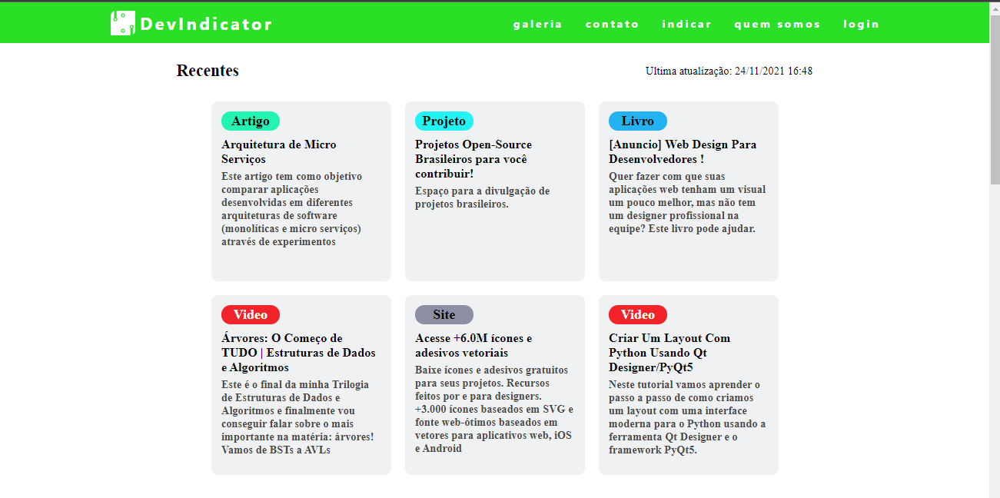
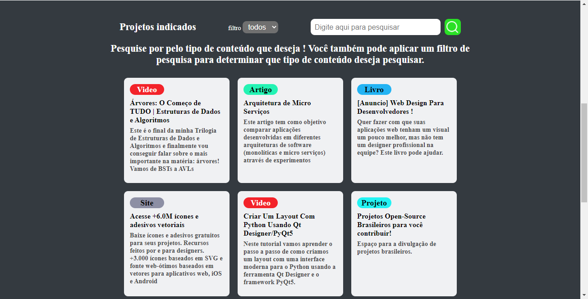
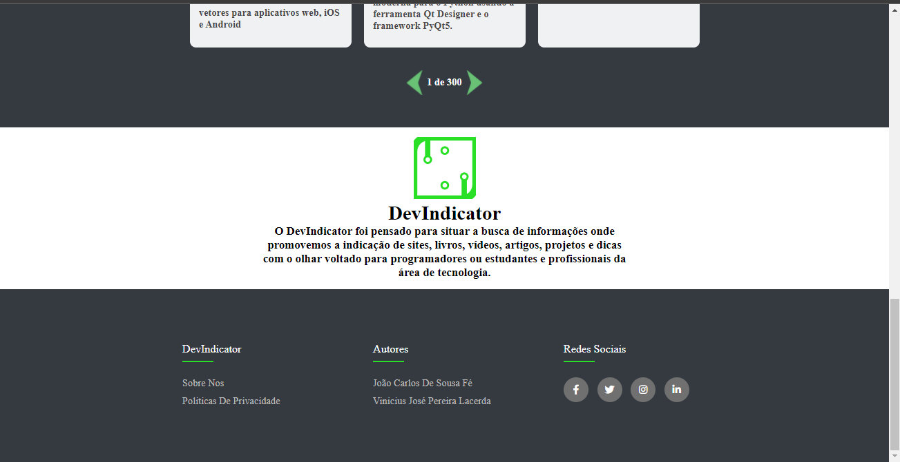
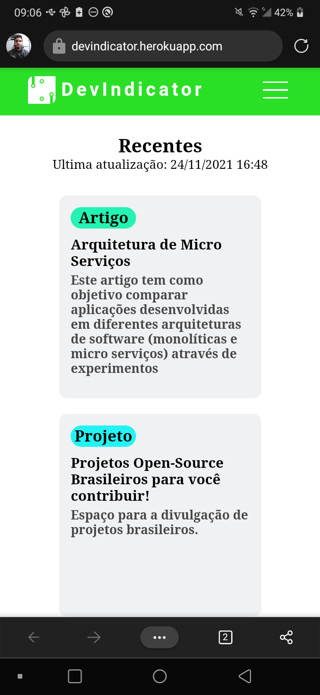
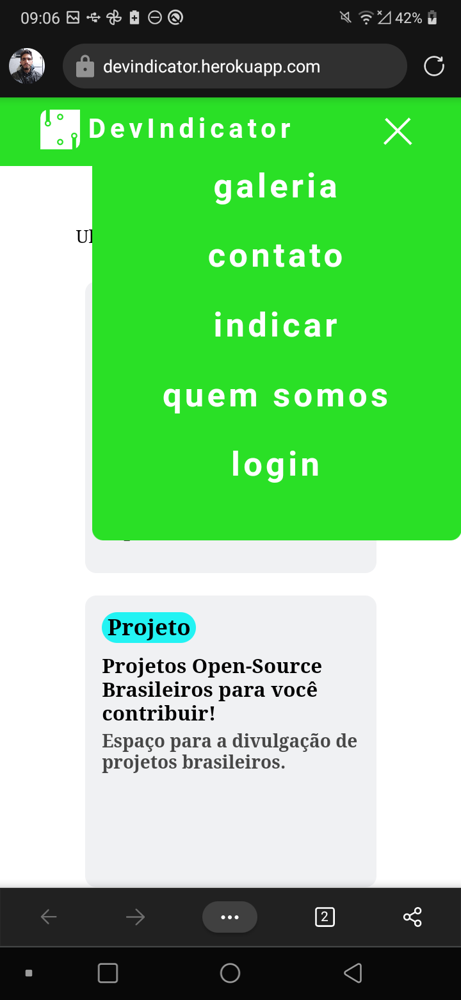
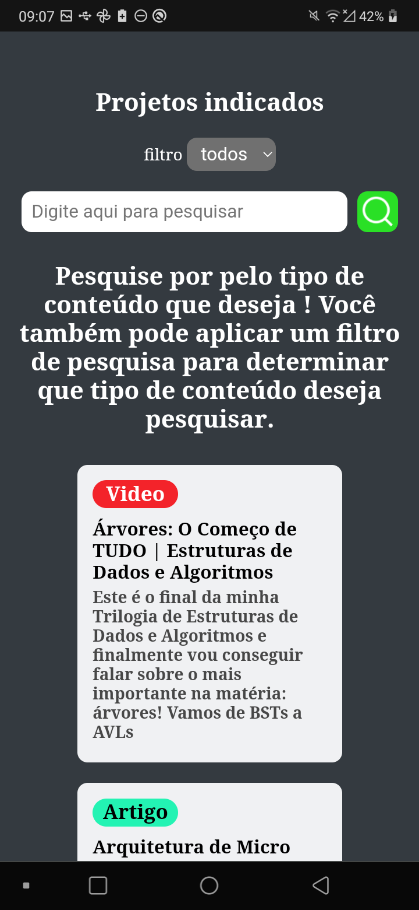
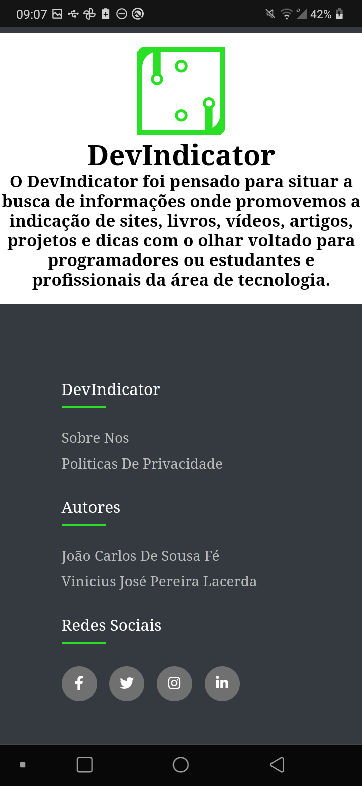
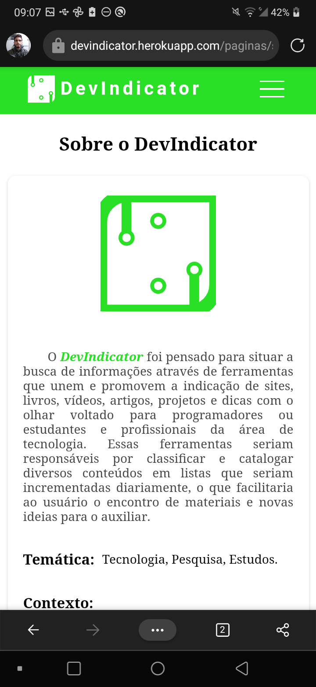

<h1>DevIndicator</h1>

O DevIndicator foi pensado para situar a busca de informações através de ferramentas que unem e promovem a indicação de sites, livros, vídeos, artigos, projetos e dicas com o olhar voltado para programadores ou estudantes e profissionais da área de tecnologia. Essas ferramentas seriam responsáveis por classificar e catalogar diversos conteúdos em listas que seriam incrementadas diariamente, o que facilitaria ao usuário o encontro de materiais e novas ideias para o auxiliar.

<h2>Foi utilizado as seguintes tecnologias para desenvolvimentos</h2>
<ul>
    <li>HTML 5</li>
    <li>CSS 3</li>
    <li>Javascript</li>
</ul>
<h2>O site é totalmente responsivo e desfruta de uma bela interface de usuário</h2>
<h3>Acesse para conferir: <a href="https://devindicator.herokuapp.com">DevIndicator</a> <h3>

<h3>Capturas de tela (Desktop)</h3>

<h3>Capturas de tela (Mobile)</h3>

